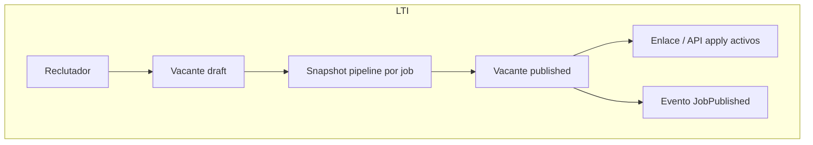
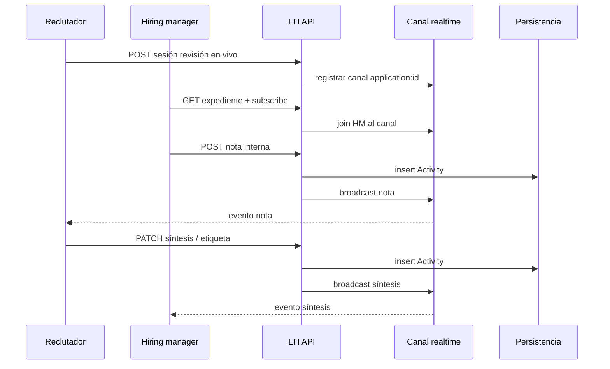
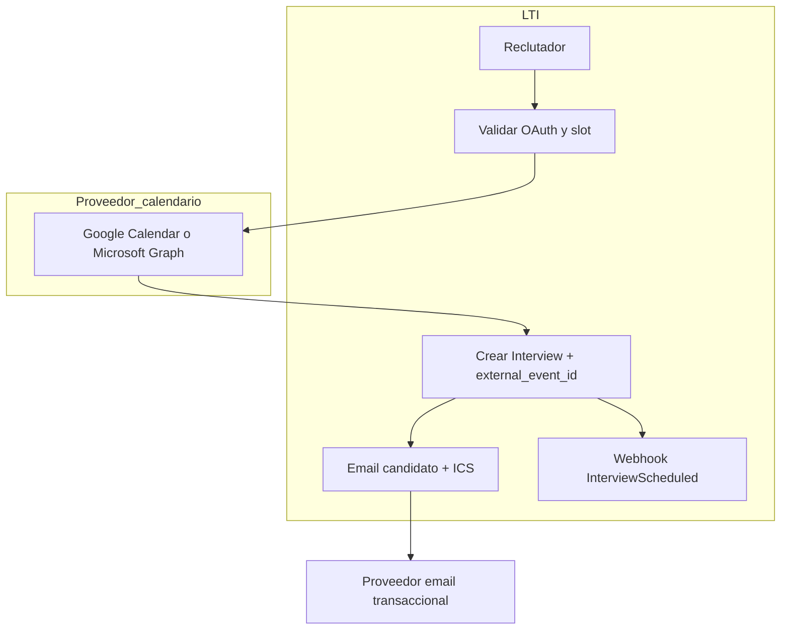
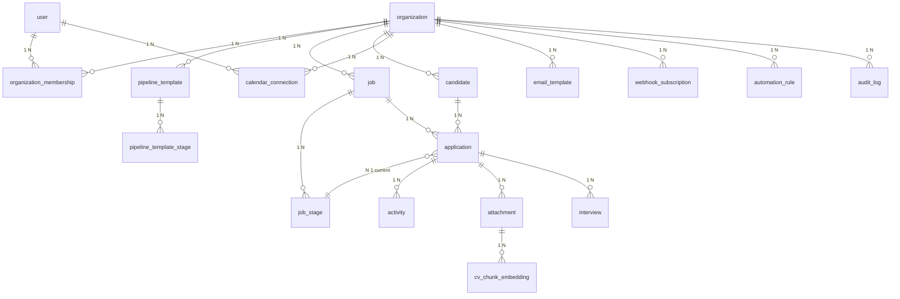
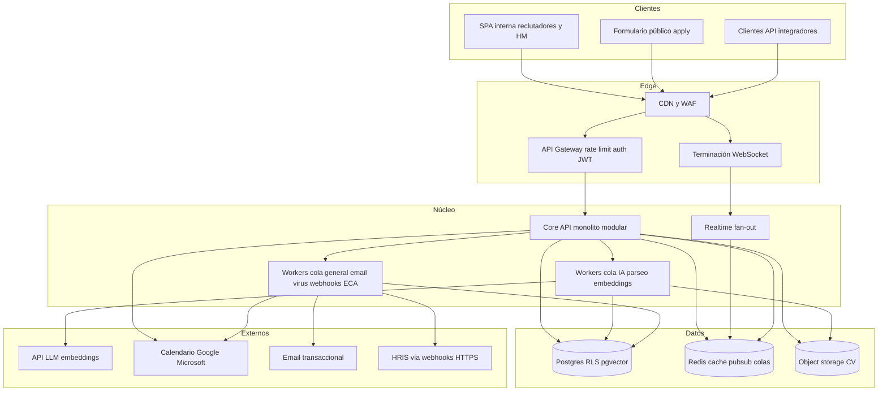

# LTI — diseño de producto v0.1

**Producto:** LTI (Applicant Tracking System, ATS) orientado a SaaS B2B.  
**Audiencia de este documento:** ingeniería senior y producto.  
**Estado:** borrador de primera versión (MVP + fundaciones).

---

## 1. Investigación y análisis

### 1.1 Descripción del software

LTI es un **ATS multi-tenant** que centraliza el ciclo de captación: publicación de vacantes, recepción y normalización de candidaturas, evaluación colaborativa, comunicación con candidatos y reporting para hiring managers y talent acquisition.

**Decisión de alcance v1:** priorizar **pipeline de candidatos + vacantes + usuarios internos** sobre marketplace de bolsa externa o RPO completo. Razón: el núcleo de retención y diferenciación en B2B es **velocidad de hiring con trazabilidad y cumplimiento**; las integraciones profundas (HRIS, LinkedIn, etc.) se modelan como extensiones.

### 1.2 Valor para el cliente

| Stakeholder | Valor |
|-------------|--------|
| TA / reclutadores | Un solo lugar para vacantes, CVs, notas y etapas; menos fricción entre herramientas. |
| Hiring managers | Visibilidad del embudo, feedback estructurado, menos reuniones de status. |
| Candidatos | Proceso claro, comunicación consistente (plantillas, estados). |
| Org / compliance | Historial de decisiones, motivos de descarte, retención configurable. |

### 1.3 Ventajas competitivas (propuesta v1)

1. **Modelo de etapas flexible por tenant** (no solo “Applied → Interview → Offer”) con reglas simples de transición — trade-off: más complejidad de UI que un ATS ultra minimalista.
2. **API-first y webhooks** desde el día uno para HRIS y portales propios — trade-off: coste de documentación y versionado de API.
3. **Multi-tenant duro** (aislamiento lógico estricto por `org_id` en todas las tablas de negocio) — trade-off: consultas cross-org solo vía jobs de plataforma, no ad-hoc.
4. **Observabilidad y auditoría** como primitivas (eventos de dominio, no solo logs técnicos) — trade-off: volumen de datos y coste de almacenamiento.

**Competidores implícitos:** ver **§1.5** (panorama de mercado). LTI v1 no busca paridad de features; apuesta por **pipeline sólido + integraciones + datos limpios**.

### 1.4 Funciones (MVP y siguiente capa)

El inventario **priorizado en una frase por función** (V1 ambiciosa pero realista) está en **§1.7**.

**MVP (imprescindible para “ATS usable”):**

- Tenants, roles (Admin, Recruiter, Hiring Manager, Viewer), invitaciones.
- Vacantes (draft, published, closed), descripción enriquecida, ubicación/modo trabajo.
- Candidatos y candidaturas (una candidatura = candidato + vacante + pipeline).
- Etapas del pipeline por vacante (plantilla + override).
- Actividades: notas internas, cambios de etapa, emails salientes (plantillas simples).
- Adjuntos (CV, cartas) con metadatos y virus scan (integración async recomendada).
- Búsqueda básica full-text sobre nombre, email, skills parseados (opcional v1.1).
- Reportes mínimos: embudo por vacante, tiempos medios por etapa.

**Post-MVP cercano (v1.x):**

- Calendario / entrevistas con sync Google/Microsoft.
- Scorecards y kits de entrevista.
- Ofertas y aprobaciones (workflow).
- Portal de carreras white-label.
- Parser de CV con revisión humana (human-in-the-loop).

**Explícitamente fuera de v1:** payroll, contratos legales firmables, assessment psicométrico nativo, sourcing masivo tipo CRM de reclutamiento.

### 1.5 Mercado ATS: líderes, fallos típicos en reviews y huecos

**Metodología:** síntesis de patrones recurrentes en reviews agregados y “cons” habituales en sitios como [G2](https://www.g2.com/), [Capterra](https://www.capterra.com/) y, donde aplica, TrustRadius; no son verbatims ni ratings puntuales (cambian cada trimestre). Sirven para **hipótesis de producto**, no como claims legales sobre un competidor.

#### Líderes actuales (referencia de mercado)

| Proveedor | Posición típica | Lectura para LTI |
|-----------|-----------------|------------------|
| **Workday Recruiting** | ATS dentro de **Workday HCM**; fuerte en enterprise global ya “en Workday”. | Valor acoplado al core HR/payroll; venta y ciclo de vida del cliente siguen la lógica de suite, no la de best-of-breed ligero. |
| **Greenhouse** | Referente **best-of-breed** en hiring estructurado (scorecards, reportes, compliance hiring). | Benchmark de profundidad TA; precio y complejidad suelen escalar con ambición del proceso. |
| **Lever** | Historial fuerte en **pipeline tipo CRM** y UX fluida para sourcers/recruiters; contexto reciente de **M&A** (p. ej. narrativa post-adquisición). | Útil para estudiar combinación ATS + nurturing; revisar riesgo percibido de roadmap/soporte tras concentración del mercado. |
| **Teamtailor** | Muy fuerte en **marca empleador**, career site y experiencia candidato; base relevante en Europa. | Competidor a batir en “front de carreras”; a veces menos peso en nicho enterprise global que Greenhouse/SmartRecruiters (depende del segmento). |
| **SmartRecruiters** | Plataforma **enterprise TA** con marketplace de integraciones y ambición de “sistema operativo” de talento. | Alto coste de implementación y expectativa de servicios; buen análogo de “todo lo que el enterprise pide”. |

#### Dos o tres puntos donde suelen fallar (reviews públicos)

1. **Complejidad operativa y curva de aprendizaje** — Especialmente para **hiring managers** poco técnicos y equipos sin TA dedicado: configuración de etapas, permisos, plantillas e informes generan fricción y quejas de “demasiados clics” o formación obligatoria (patrón común en suites enterprise y en suites TA ricas en features). *Trade-off interno del categoría:* más capacidad ⇒ más superficie de configuración.
2. **TCO opaco y escalado “anti-intuitivo”** — Modelos por empleado, módulos, add-ons y servicios profesionales hacen **difícil predecir coste**; en G2/Capterra aparecen con frecuencia comentarios sobre **precio elevado** frente al valor percibido en equipos pequeños o hiring esporádico.
3. **Soporte e integraciones** — Colas de soporte, respuestas genéricas o **dependencia de partners** para integraciones HRIS/SSO; en paralelo, **integraciones frágiles** o roturas tras upgrades son un tema recurrente en herramientas con ecosistema amplio (más visible en foros de reviews y TrustRadius en casos puntuales de Lever/Legacy stacks).

> Estos tres patrones no aplican por igual a cada comprador; sí condicionan el **RFP** y el NPS segmentado (enterprise vs mid-market).

#### Huecos que un ATS nuevo puede atacar

| Hueco | Por qué existe | Apuesta LTI (dirección) |
|-------|----------------|-------------------------|
| **Time-to-value** | Implementaciones largas y consultoría cara en suite + enterprise ATS. | Opinión: MVP con **defaults sensatos** (pipelines, roles, plantillas) y **go-live en días**, no meses. |
| **Transparencia y control técnico** | APIs y webhooks como segunda ciudadanía; datos difíciles de extraer sin add-ons. | **API-first + eventos de dominio** y exportación clara; pricing publicado o estimator para mid-market. |
| **Experiencia HM sin “sacrificar” compliance** | Suites ricas castigan al usuario ocasional; herramientas simples pierden auditoría. | UI **orientada a tareas** para HM (aprobar, comentar, mover) con **auditoría fuerte** bajo el capó. |
| **EU / soberanía de datos y RGPD** | Incertidumbre sobre residencia y retención con vendors US-centric. | Roadmap: **DC EU**, DPA estándar, retención por política; mensaje claro frente a incertidumbre. |
| **No querer reemplazar HCM** | Muchas empresas ya tienen Workday/Bamboo/etc. y solo quieren **mejor ATS**. | Posicionar LTI como **capa de captación** integrable, no como reemplazo de payroll/core HR. |

### 1.6 Posicionamiento diferencial y comparativa breve

**Posicionamiento (una frase):** *LTI es el ATS B2B **API-first** para organizaciones que quieren un **pipeline auditable y rápido de desplegar**, sin acoplarse a una suite HCM ni pagar la complejidad completa de un enterprise TA legacy.*

#### Tabla comparativa breve (LTI v1 orientativo vs. referentes)

Dimensión definida en **términos de producto**, no de calidad absoluta.

| Dimensión | LTI (v1 propuesta) | Greenhouse | Lever | Workday Recruiting | Teamtailor | SmartRecruiters |
|-----------|-------------------|-------------|-------|-------------------|------------|-----------------|
| **Ancla de valor** | Pipeline + eventos + integración | Hiring estructurado + reporting | Pipeline/CRM + automatización | Core HR + recruiting unificado | Carreras + experiencia candidato | Enterprise TA + marketplace |
| **Time-to-value** | Alto (opinión: semanas) | Medio | Medio | Bajo (implementación suite) | Medio-alto | Bajo-medio |
| **Modelo económico típico** | Opinión: **transparente** / uso (a validar) | Enterprise, custom | Enterprise, custom | Suite, custom | SMB-mid + tiers | Enterprise, custom |
| **Profundidad “enterprise TA”** | Baja → media (v1) | Alta | Media-alta | Muy alta | Media (segmento) | Muy alta |
| **Marca empleador / career** | Post-MVP (portal) | Fuerte (ecosistema) | Buena | Depende implementación | **Muy fuerte** | Buena |
| **API / webhooks como pilar** | **Sí (v1)** | Sí (maduro) | Sí | Sí (vía plataforma) | Sí | Sí (amplio) |
| **Curva para hiring managers** | Opinión: baja en flujos MVP | Media-alta | Media | Alta | Baja-media | Alta |

**Trade-off explícito del posicionamiento:** renunciar a paridad con **Workday/SmartRecruiters** en roadmap día 1 para ganar **velocidad, claridad técnica y coste predecible** en mid-market y scale-ups; el riesgo es que compradores enterprise exijan checklists (assessments, compliance modules) antes de evaluar la propuesta.

### 1.7 Funciones principales V1 (ambiciosa pero realista)

Catálogo **priorizado** alineado con §1.5–1.6: time-to-value, API/eventos, auditoría y experiencia usable para HM. *12 funciones* en cuatro bloques; cada ítem = **una frase** (qué + por qué importa). Los límites “fuera de alcance” siguen en **§1.4**.

#### Fundaciones: tenant, identidad y permisos

1. **Multi-tenant con RBAC e invitaciones** — Aísla datos por organización, asigna Admin/Recruiter/HM/Viewer y evita cuentas compartidas, que es donde suelen romperse cumplimiento y trazabilidad en equipos en crecimiento.

#### Vacante y motor de proceso

2. **Ciclo de vida de vacantes (borrador → publicada → cerrada)** — Publica o pausa ofertas con control de estado para que candidatos y reporting no mezclen posiciones obsoletas con activas.

3. **Plantillas de pipeline + snapshot por vacante** — Clona etapas al abrir un proceso y congela el esquema por vacante para que el historial no se reescriba cuando cambie la plantilla global.

4. **Historial de etapas y motivos de rechazo/retirada** — Registra quién movió a quién, desde/hasta dónde y con razón opcional para defender decisiones ante inspección interna o reclamaciones.

#### Talento, colaboración y confianza

5. **Candidatos y candidaturas con antiduplicado por email (por tenant)** — Mantiene una ficha de persona coherente y varias solicitudes sin silos por vacante, reduciendo ruido operativo para TA.

6. **Bandeja tipo embudo (lista/kanban) con transiciones validadas** — Da a reclutadores y HM una vista única del avance y bloquea saltos ilegales de etapa, alineando UX simple con reglas de proceso.

7. **Actividades y notas internas con visibilidad por rol** — Centraliza feedback y contexto junto al expediente para sustituir hilos dispersos en email/Slack y acelerar decisiones.

8. **Adjuntos (CV/carta) con almacenamiento seguro y antivirus asíncrono** — Protege el canal de entrada de malware y da una cadena de custodia mínima aceptable para RR.LL. y seguridad.

9. **Plantillas de correo y disparadores en hitos (p. ej. recepción, rechazo)** — Estandariza comunicación con candidatos para mejorar experiencia y reducir errores de tono o datos en momentos sensibles.

#### Captación, integración y visibilidad

10. **Formulario público de candidatura + límites anti-abuso básicos** — Capta talento sin depender solo de integraciones y mitiga spam/bots que degradan datos y métricas.

11. **API REST versionada y webhooks firmados sobre eventos de dominio** — Permite orquestar HRIS, portales propios y automatizaciones sin scraping, atacando el hueco de “integraciones frágiles” descrito en reviews.

12. **Búsqueda full-text y reporting de embudo/tiempos por etapa exportable** — Hace localizable el talento ya capturado y cuantifica cuellos de botella para justificar inversión y priorizar mejoras de proceso.

**Trade-off de esta V1:** incluye **reporting y búsqueda** (no “MVP minimal”) porque sin ellos el producto no compite en credibilidad con managers; se asume **sin** portal de carreras white-label ni scorecards avanzados (§1.4 post-MVP) para no inflar implementación.

---

## 2. Casos de uso principales

### 2.1 Actores

- **Admin tenant:** configura pipeline, usuarios, integraciones.
- **Recruiter:** crea vacantes, mueve candidatos, comunica.
- **Hiring manager:** revisa candidatos asignados, deja feedback.
- **Candidato (externo):** aplica vía enlace público o integración.
- **Sistema:** notificaciones, webhooks, jobs (parseo, scan).

### 2.2 Tres casos de uso representativos (por eje)

Selección editorial para cubrir **eficiencia**, **colaboración** y **automatización vía integraciones**; el detalle operativo (actores, pre/post, flujo principal y diagrama) está en **§2.3–2.5** como **CU-01 a CU-03**.

| Eje | Caso de uso documentado | Justificación breve |
|-----|-------------------------|----------------------|
| **Eficiencia (HR clásico)** | **CU-01 — Publicar vacante** | Activa captación con pipeline correcto y enlaces/API sin retrabajo. |
| **Colaboración en tiempo real** | **CU-02 — Evaluación colaborativa del candidato** | Varias personas alineadas sobre el mismo expediente con señalización en vivo. |
| **Automatización / integraciones** | **CU-03 — Programar entrevista** | Reduce fricción con calendarios corporativos y notificaciones automáticas. |

### 2.3 CU-01 — Publicar vacante y activar captación

**Actor primario:** Reclutador (rol *Recruiter*).  
**Actores secundarios:** Administrador del tenant (plantilla de pipeline por defecto, si aplica); **Sistema** (snapshot de etapas, generación de enlaces, eventos de dominio).

**Precondición:** El usuario pertenece al tenant con permiso `job:write`; existe al menos una **plantilla de pipeline** publicable o permiso para crear etapas manuales; el tenant no está suspendido por billing.

**Postcondición:** La vacante queda en estado `published` con **snapshot de pipeline** inmutable para esa vacante; existen **URL pública de candidatura** y/o endpoint de aplicación documentado; se emite evento `JobPublished` (p. ej. para webhooks).

**Flujo principal**

1. El reclutador crea la vacante en `draft` y completa título, descripción, ubicación/modalidad y requisitos mínimos.
2. Selecciona una plantilla de pipeline o confirma el pipeline por defecto del tenant; el sistema **clona** las etapas al contexto de la vacante (snapshot).
3. El reclutador revisa el orden y nombres de etapas en el snapshot y confirma (sin alterar plantillas globales de otros jobs).
4. El reclutador pulsa **Publicar**; el sistema valida campos obligatorios y transición `draft → published`.
5. El sistema genera/regenera el **token/enlace** de aplicación pública y habilita la recepción de candidaturas (rate limiting activo).
6. El sistema registra `published_at`, persiste el estado y encola notificaciones internas opcionales (p. ej. a TA lead).
7. El sistema emite `JobPublished` hacia el bus de integración (webhooks suscritos).

### 2.4 CU-02 — Evaluación colaborativa del candidato (sesión en vivo)

**Actor primario:** Hiring manager (rol *Hiring Manager*).  
**Actores secundarios:** Reclutador (facilita la sesión y documenta); **Sistema** (canal en tiempo real, fan-out de actividades, control de permisos).

**Precondición:** Existe una **candidatura** (`application`) en etapa que permite revisión colaborativa; HM y reclutador tienen **visibilidad** sobre la candidatura; la sesión “live” está habilitada en el tenant (feature flag o plan).

**Postcondición:** Las **notas y presencia** quedan reflejadas en el expediente con marca temporal y actor; ambos clientes muestran el mismo estado consolidado; se registra actividad tipo `CollaborativeReview` (payload mínimo: participantes, duración opcional).

**Flujo principal**

1. El reclutador abre el expediente de la candidatura e inicia **“Revisión en vivo”**, invitando al HM (enlace profundo o notificación in-app).
2. El HM entra al mismo `applicationId`; el cliente establece suscripción **WebSocket/SSE** al canal `application:{id}`.
3. El sistema autentica ambas sesiones y autoriza `application:read` + `note:write` según rol.
4. El HM añade una **nota interna**; el servicio realtime difunde el evento a suscriptores del canal.
5. El reclutador ve la nota al instante y actualiza un **campo de síntesis** (p. ej. “recomendación” o etiqueta) visible para ambos.
6. El sistema persiste cada cambio como **Activity** con `actor_user_id` y orden de versión lógica.
7. Al cerrar la vista, el sistema opcionalmente registra fin de sesión y mantiene el hilo consultable para auditoría.

### 2.5 CU-03 — Programar entrevista con calendario externo

**Actor primario:** Reclutador.  
**Actores secundarios:** Hiring manager y **entrevistadores** (como invitados al evento); **Candidato** (destinatario de comunicación); **Google Calendar** / **Microsoft 365** (creación de evento); **Sistema** (tokens OAuth, plantillas de email, registro `Interview`).

**Precondición:** La candidatura está en etapa que permite agendar entrevista; el tenant tiene **integración de calendario** conectada con **OAuth válido** para el organizador; existen fecha/hora y participantes confirmados para la cita.

**Postcondición:** Queda un registro **Interview** en LTI enlazado a la candidatura (fecha/hora, duración, participantes); el **evento** existe en el calendario externo del organizador (y opcionalmente invitaciones enviadas); el candidato recibe **email** con detalles y/o adjunto ICS.

**Flujo principal**

1. El reclutador abre la candidatura y elige **Programar entrevista**, indicando tipo, duración y participantes internos.
2. El sistema comprueba el **token OAuth** del proveedor de calendario del organizador y obtiene el contexto de escritura necesario para crear eventos.
3. El reclutador confirma fecha/hora y zona horaria; el sistema valida solapes básicos contra calendario del organizador vía API del proveedor.
4. El sistema llama a **Google Calendar API** o **Microsoft Graph** para crear el evento con asistentes (HM, entrevistadores) y descripción con enlace al expediente LTI.
5. El sistema persiste `Interview` con `external_event_id` y metadatos de proveedor.
6. El sistema envía al **candidato** email desde plantilla (asunto, cuerpo, ubicación/enlace videollamada).
7. El sistema registra actividad `InterviewScheduled` y, si está configurado, dispara **webhook** para HRIS.

*Nota de modelo:* la entidad `Interview` y el resto del modelo relacional están definidos en **§3**.

---

## 3. Modelo de datos (V1)

**Multi-tenancy:** todas las entidades de negocio llevan **`org_id : UUID`** (FK a `organization`), incluidas las tablas hijas accesibles por API, para **RLS y consultas con un único predicado**. El término producto “tenant” equivale a `organization`.

**Postgres + pgvector:** extensión `vector`; embeddings por **fragmento** de CV (`cv_chunk_embedding`), no un solo vector por fichero, para búsqueda semántica usable en documentos largos.

**Audit log:** tabla **`audit_log`** solo inserción (**append-only**): sin `updated_at` ni `DELETE` en aplicación; cumplimiento de trazabilidad de acceso y cambios sobre datos personales (GDPR art. 5.2, 30).

**Casos de uso cubiertos:** solo entidades que participan en **CU-01** (publicar vacante), **CU-02** (evaluación colaborativa) o **CU-03** (programar entrevista), más primitivas mínimas (**automation_rule**, **audit_log**, **cv_chunk_embedding**) exigidas por requisitos de producto.

### 3.1 Entidades y atributos (`nombre : tipo`)

| Entidad | Atributos |
|---------|-----------|
| **organization** | `id : UUID`, `name : string`, `slug : string`, `plan : enum`, `settings : jsonb`, `created_at : timestamp`, `updated_at : timestamp` |
| **user** | `id : UUID`, `email : string`, `name : string`, `password_hash : string` (nullable si SSO), `created_at : timestamp`, `updated_at : timestamp` |
| **organization_membership** | `id : UUID`, `org_id : UUID`, `user_id : UUID`, `role : enum`, `status : enum`, `created_at : timestamp`, `updated_at : timestamp` |
| **pipeline_template** | `id : UUID`, `org_id : UUID`, `name : string`, `is_default : boolean`, `created_at : timestamp`, `updated_at : timestamp` |
| **pipeline_template_stage** | `id : UUID`, `org_id : UUID`, `pipeline_template_id : UUID`, `name : string`, `sort_order : integer`, `stage_type : enum`, `created_at : timestamp` |
| **job** | `id : UUID`, `org_id : UUID`, `title : string`, `description : text`, `status : enum`, `employment_type : enum`, `location : string`, `pipeline_template_id : UUID` (nullable tras snapshot), `published_at : timestamp` (nullable), `closed_at : timestamp` (nullable), `created_at : timestamp`, `updated_at : timestamp` |
| **job_stage** | `id : UUID`, `org_id : UUID`, `job_id : UUID`, `name : string`, `sort_order : integer`, `stage_type : enum`, `created_at : timestamp` |
| **candidate** | `id : UUID`, `org_id : UUID`, `email : string`, `full_name : string`, `phone : string` (nullable), `source : string` (nullable), `created_at : timestamp`, `updated_at : timestamp` |
| **application** | `id : UUID`, `org_id : UUID`, `job_id : UUID`, `candidate_id : UUID`, `current_job_stage_id : UUID`, `status : enum`, `review_summary : text` (nullable, p. ej. CU-02), `created_at : timestamp`, `updated_at : timestamp` |
| **activity** | `id : UUID`, `org_id : UUID`, `application_id : UUID`, `type : enum`, `payload : jsonb`, `actor_user_id : UUID` (nullable), `created_at : timestamp` |
| **attachment** | `id : UUID`, `org_id : UUID`, `application_id : UUID`, `storage_key : string`, `filename : string`, `mime : string`, `virus_scan_status : enum`, `created_at : timestamp` |
| **cv_chunk_embedding** | `id : UUID`, `org_id : UUID`, `attachment_id : UUID`, `chunk_index : integer`, `chunk_text : text`, `embedding : vector(1536)`, `model : string`, `created_at : timestamp` |
| **interview** | `id : UUID`, `org_id : UUID`, `application_id : UUID`, `starts_at : timestamp`, `duration_minutes : integer`, `organizer_user_id : UUID`, `external_provider : enum`, `external_event_id : string`, `meeting_url : string` (nullable), `created_at : timestamp`, `updated_at : timestamp` |
| **calendar_connection** | `id : UUID`, `org_id : UUID`, `user_id : UUID`, `provider : enum`, `encrypted_refresh_token : text`, `encrypted_access_token : text`, `token_expires_at : timestamp` (nullable), `created_at : timestamp`, `updated_at : timestamp` |
| **email_template** | `id : UUID`, `org_id : UUID`, `template_key : string`, `subject : string`, `body_md : text`, `created_at : timestamp`, `updated_at : timestamp` |
| **webhook_subscription** | `id : UUID`, `org_id : UUID`, `url : string`, `secret : string`, `event_types : jsonb`, `active : boolean`, `created_at : timestamp`, `updated_at : timestamp` |
| **automation_rule** | `id : UUID`, `org_id : UUID`, `name : string`, `enabled : boolean`, `trigger_event : string`, `condition : jsonb`, `action : jsonb`, `priority : integer`, `created_at : timestamp`, `updated_at : timestamp` |
| **audit_log** | `id : UUID`, `org_id : UUID` (nullable solo si eventos de plataforma), `actor_user_id : UUID` (nullable), `action : string`, `entity_type : string`, `entity_id : UUID` (nullable), `payload : jsonb`, `ip_address : string` (nullable), `user_agent : string` (nullable), `occurred_at : timestamp` |

**Restricciones sugeridas:** `UNIQUE (org_id, email)` en `candidate`; `UNIQUE (org_id, template_key)` en `email_template`; índice compuesto `(org_id, id)` en todas las tablas de negocio; **prohibir UPDATE/DELETE** en `audit_log` desde roles de aplicación (solo rol de migración/archivado).

### 3.2 Diagrama ER con cardinalidades

> Lectura: `application }o--|| job_stage` indica que cada candidatura apunta a **exactamente una** etapa actual del job; muchas candidaturas pueden estar en la misma etapa.

### 3.3 Notas de diseño

1. **`org_id` redundante en tablas hijas** (`activity`, `job_stage`, etc.): duplica el árbol del job bajo el org para que RLS y particionado futuro usen **una sola columna** sin JOIN obligatorio a `job` en cada política; coste: consistencia validada por transacción o trigger ligero.

2. **`cv_chunk_embedding` separado de `attachment`**: un CV genera N fragmentos; el embedding es **por chunk** para recuperación semántica y límites de tamaño del modelo; trade-off: más filas e índice HNSW/IVFFlat más pesado que un único vector por documento.

3. **`audit_log` vs `activity`**: `activity` es la **línea de tiempo de producto** visible y usable en expediente; `audit_log` es **traza de cumplimiento** (quién tocó qué dato personal, desde qué IP) y no debe editarse ni borrarse en runtime normal; evita mezclar UX con requisitos legales.

4. **`automation_rule` con `condition` y `action` en jsonb**: el motor ECA evalúa triggers (`trigger_event` alineado a eventos de dominio, p. ej. `JobPublished`, `InterviewScheduled`) sin migración por cada regla nueva; trade-off: validación fuerte en aplicación y tests contractuales del esquema JSON.

5. **`pipeline_template_stage` copiado a `job_stage` al publicar (CU-01)**: las etapas efectivas viven solo en `job_stage` tras el snapshot; `pipeline_template_id` en `job` queda referencia histórica o nula; evita modelos polimórficos `stage` con FKs mutuamente excluyentes.

6. **`calendar_connection` por `user_id` dentro del `org_id`**: el token OAuth es del **organizador humano** (CU-03), no del tenant global; permite revocación por usuario y auditoría más fina que un único token corporativo compartido.

---

## 4. Diseño de alto nivel (arquitectura)

### 4.1 Contexto V1

- **Startup, equipo pequeño, entrega rápida:** un único servicio de aplicación versionado y desplegado junto (monolito modular), evitando red de microservicios operada a medias.
- **Carga orientativa:** hasta **~100 000 candidatos/mes** en early enterprise (orden de magnitud **<200 candidaturas/hora** de media con picos diurnos mayores); el cuello real suele ser **adjuntos + IA + picos de apply**, no el CRUD de vacantes.
- **Tiempo real:** colaboración en expediente (CU-02) y notificaciones in-app con latencia sub-segundo percibida.
- **IA central:** extracción/estructuración de CV, **embeddings + búsqueda semántica** y asistencia en redacción/comunicación forman parte del **camino feliz**, no un add-on.

### 4.2 Stack tecnológico recomendado por capa

| Capa | Stack recomendado | Rol |
|------|-------------------|-----|
| **Cliente web** | SPA **TypeScript** (p. ej. React + Vite) o **Next.js** si se prioriza SEO en portal público mínimo | Una codebase compartida con tipos OpenAPI generados; reduce fricción en equipo pequeño. |
| **Auth / sesión** | **OIDC** (SSO enterprise) + **JWT** de corta duración para API; proveedor gestionado (Clerk, Auth0, Stytch…) o IdP propio solo si ya hay capacidad DevOps | Acelera cumplimiento de MFA y delegación de credenciales. |
| **Edge** | **CDN + WAF** (Cloudflare, CloudFront+AWS WAF) delante del origen; **TLS**, caching de estáticos, mitigación de bots en `/apply` | Protege el formulario público sin lógica en el monolito. |
| **API pública / BFF** | **API Gateway** ligero (AWS API Gateway, Kong, o reverse proxy **nginx/Traefik** con rate limit por `org_id` + IP) | Terminación TLS, límites de tasa, enrutamiento `/v1` y cabeceras de trazabilidad. |
| **Núcleo (API síncrona)** | **Monolito modular** TypeScript (**NestJS** o **Fastify**) *o* **Python (FastAPI)** si el equipo es más ML-first; contrato **OpenAPI** versionado | Dominios: tenancy, jobs, applications, comms, integrations, **motor ECA** leyendo reglas en Postgres. |
| **Tiempo real** | **WebSocket** (mismo proceso que API o proceso colindante) con **backplane Redis** (adapter Socket.io / equivalente) *o*, si se prioriza time-to-market sobre coste, **Pusher/Ably** gestionado | Fan-out de eventos de expediente; Redis evita sticky sessions estrictas en múltiples réplicas. |
| **Workers (async)** | **Cola + workers** (BullMQ sobre Redis, Sidekiq, o Celery+Rabbit) separando cola **“IA”** (larga CPU/red) de cola **“default”** (email, virus scan, webhooks) | Evita que un pico de embeddings mate la latencia de la API. |
| **IA / ML** | **API de modelo** (OpenAI, Azure OpenAI, Anthropic…) para parsing y texto; **embeddings** del mismo proveedor alineados a `vector(1536)` en §3; **pgvector** para ANN; opcional **rerank** barato en segundo paso | Un solo stack de proveedor reduce operaciones; coste variable acotado con cuotas y batch. |
| **Datos transaccionales** | **PostgreSQL 16+** con **RLS por `org_id`**, **pgvector**, índices HNSW/IVFFlat según volumen | Fuente de verdad única: negocio + vectores + audit append-only. |
| **Caché / pub-sub / colas ligeras** | **Redis** (ElastiCache, Memorystore, Redis Cloud) | Sesiones de rate limit, pub/sub realtime, broker de colas si BullMQ. |
| **Archivos** | **Object storage S3-compatible** + URLs prefirmadas + antivirus en worker | CV fuera del disco del contenedor; escala con el volumen de adjuntos. |
| **Observabilidad** | **OpenTelemetry** → Grafana Cloud / Datadog / Honeycomb; logs estructurados JSON | Imprescindible para depurar IA (latencias, errores por prompt) y cumplimiento. |

### 4.3 Diagrama de arquitectura (`flowchart`)

### 4.4 Decisiones clave y trade-offs

- **Monolito modular frente a microservicios:** se elige **un despliegue** para maximizar velocidad de equipo pequeño; el riesgo es el acoplamiento si no hay límites de módulo (carpetas + reglas de import en CI). Microservicios solo cuando una métrica dolorosa (CPU IA vs API) lo justifique.
- **Postgres como único almacén de negocio + vectores:** simplifica backup, transacciones y joins CV↔embedding; el trade-off es **tuning** de índices vectoriales y presión de RAM en instancias pequeñas frente a un motor dedicado (OpenSearch, Pinecone).
- **Cola IA separada:** aisla latencias impredecibles del proveedor LLM del camino síncrono HTTP; el trade-off es **consistencia eventual** (el usuario ve el CV antes de que existan embeddings listos).
- **Realtime con Redis backplane vs SaaS:** Redis **reduce coste fijo** y mantiene datos en tu cuenta; SaaS tipo Ably **reduce código y incidentes** a cambio de factura y dependencia de tercero para colaboración.
- **Edge con WAF gestionado:** absorbe bots y volumetría en `/apply` sin tocar el monolito; trade-off: configuración correcta de **orígenes** y caché para no romper WebSockets o uploads multipart.
- **IA vía API de terceros en V1:** time-to-market y calidad de modelo superan a self-host de LLM en startup; trade-off: **PII en tránsito** a proveedor → DPA, minimización de prompts y opción **Azure OpenAI** en tenants sensibles.
- **~100 k candidatos/mes:** el sistema aguanta con **réplicas horizontales** del API + pool de conexiones a Postgres ajustado; el primer escalado forzado será **adjuntos + workers IA**, no la API de listados si hay índices adecuados.

### 4.5 Seguridad y multi-tenant

- **RLS** en PostgreSQL por `org_id` como red de seguridad además de checks en aplicación.
- **Tests de aislamiento** en CI: consultas sin `org_id` deben fallar.
- **Rate limiting** por organización y por IP en apply público y en endpoints de inferencia si se exponen.

### 4.6 Roadmap técnico resumido

1. Auth, organizaciones, membresías y RBAC.  
2. Jobs, snapshot de pipeline, applications y apply público.  
3. Adjuntos, antivirus asíncrono y **pipeline IA**: chunking + embeddings → **pgvector**.  
4. Realtime en expediente + activities.  
5. Webhooks, motor **ECA**, API pública `/v1`.  
6. Observabilidad end-to-end (incl. trazas en llamadas LLM con IDs de correlación, sin contenido PII en spans).

---

## Apéndice: métricas de producto (north star sugerida)

- **Time to first screen** (median): días desde `applied` a primera decisión de etapa.  
- **Offer accept rate** (post-MVP ofertas).  
- **WAU reclutadores** por tenant (adopción).

---

*Documento vivo: actualizar según feedback de discovery y restricciones legales (GDPR, retención CV).*
