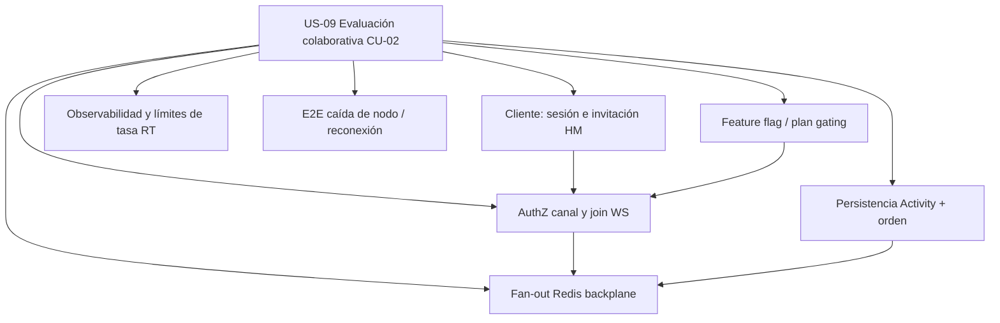

# User stories y backlog MVP — LTI (RPL)

## 1. User stories (INVEST)

*Alcance estrictamente anclado a §1.7 y §2.3–2.5 del PRD LTI; agrupación por cohesión de entrega y reducción de acoplamiento innecesario entre historias.*

---

### US-01 — Organización segura con roles e invitaciones desde el primer día

**Historia:** Como **administrador del tenant**, quiero **aislar datos por organización, asignar roles (Admin, Recruiter, Hiring Manager, Viewer) e invitar usuarios**, para **evitar cuentas compartidas y cumplir trazabilidad y RBAC desde el origen**.

**Criterios de aceptación (Gherkin)**

```gherkin
Dado que no existe organización para el comprador
Cuando un usuario crea una organización y se convierte en Admin
Entonces queda registrada con org_id y el usuario tiene membresía activa con rol Admin

Dado que un Admin autenticado en su org_id
Cuando invita por email a un usuario con rol Recruiter
Entonces se crea membresía pendiente y el invitado solo ve datos de esa org al aceptar

Dado que un usuario con rol Viewer
Cuando intenta llamar a un endpoint de escritura de vacantes
Entonces la API responde 403 y se registra intento en audit_log según política del PRD

Dado que existen dos organizaciones A y B
Cuando un usuario miembro solo de A consulta recursos con org_id de B
Entonces no obtiene filas (RLS + chequeos de aplicación) y no hay fuga de datos entre tenants
```

**Notas técnicas breves:** Contratos `POST /v1/organizations`, `POST /v1/memberships/invite`, `PATCH /v1/memberships/:id`; claims JWT con `org_id` y `role`; eventos de dominio opcionales `OrganizationCreated`, `MembershipActivated` (si el bus los expone en US-07); validación `UNIQUE(org_id, email)` en candidatos no aplica aquí pero el aislamiento `org_id` en todas las tablas de negocio sí.

**Dependencias:** Ninguna (fundación).

**MoSCoW:** Must.

**RICE:** Reach 10 (toda org en MVP), Impact 3 (bloqueante legal/venta B2B), Confidence 0,85 (patrón estándar OIDC+RLS), Effort 6 → **(10×3×0,85)/6 = 4,25**.

**Estimación:** **8 SP** (~**10 días** persona; equipo 4 personas ≠ 10 días calendario).

**Métrica de éxito:** % de acciones de escritura rechazadas correctamente por rol ≥ 99 % en pruebas de carga de permisos y 0 incidencias P1 de fuga cross-tenant en UAT.

---

### US-02 — Publicar vacante con snapshot de pipeline y activación de captación (CU-01)

**Historia:** Como **reclutador**, quiero **crear una vacante en borrador, clonar etapas desde plantilla a snapshot por job, revisarlas y publicar con enlace/API de candidatura activos**, para **activar captación sin reescribir historiales ni mezclar procesos obsoletos**.

**Criterios de aceptación (Gherkin)**

```gherkin
Dado una plantilla de pipeline con etapas ordenadas y un job en draft
Cuando el reclutador confirma el snapshot de job_stage
Entonces las etapas quedan asociadas al job sin mutar pipeline_template_stage de otras vacantes

Dado un job en draft con campos obligatorios completos y snapshot confirmado
Cuando el reclutador publica (draft → published)
Entonces status=published, published_at rellenado y recepción de candidaturas habilitada con rate limiting activo

Dado un job publicado
Cuando se consulta la plantilla global original
Entonces los cambios futuros en la plantilla no alteran job_stage ya existentes del job

Dado un job publicado con permisos adecuados
Cuando el sistema completa la publicación
Entonces se emite evento JobPublished hacia el bus de integración según PRD
```

**Notas técnicas breves:** `POST/PATCH /v1/jobs`, `POST /v1/jobs/:id/publish`; transición validada `draft→published`; copia transaccional template→`job_stage`; token/enlace público apply; evento `JobPublished`; validaciones billing “tenant no suspendido” del CU-01.

**Dependencias:** US-01.

**MoSCoW:** Must.

**RICE:** Reach 10, Impact 3 (core ATS), Confidence 0,8, Effort 7 → **(10×3×0,8)/7 ≈ 3,43**.

**Estimación:** **8 SP** (~**10 días**).

**Métrica de éxito:** Mediana tiempo desde “crear borrador” hasta “published” < 15 min para usuarios de referencia y 100 % de jobs publicados en UAT con snapshot inmutable verificado en BD.

---

### US-03 — Captación pública con candidaturas deduplicadas por email (CU-01 recepción)

**Historia:** Como **candidato externo**, quiero **enviar mi candidatura por formulario público con límites anti-abuso**, para **aplicar sin fricción y sin degradar la calidad de datos del tenant**; como **reclutador**, quiero **reutilizar la ficha de candidato si el email ya existe en la org**, para **evitar duplicados operativos**.

**Criterios de aceptación (Gherkin)**

```gherkin
Dado un job published y un enlace/token de apply válido
Cuando un candidato envía el formulario con datos mínimos válidos
Entonces se crea o reutiliza candidate por UNIQUE(org_id, email) y se crea application asociada al job y etapa inicial

Dado el endpoint público de apply
Cuando se supera el umbral de solicitudes por IP/org configurado
Entonces se aplica throttling/WAF+gateway según arquitectura y se responde sin persistir abuso

Dado un candidato existente en la org
Cuando aplica a un segundo job
Entonces existen dos applications distintas ligadas al mismo candidate_id

Dado una candidatura creada
Cuando el sistema normaliza email
Entonces el antiduplicado respeta org_id (no cruza organizaciones)
```

**Notas técnicas breves:** `POST /public/apply` (o equivalente versionado); rate limit por `org_id`+IP (PRD §4); eventos opcionales `ApplicationCreated`; validación estados job solo `published`; no inventar campos extra no mencionados en PRD.

**Dependencias:** US-02.

**MoSCoW:** Must.

**RICE:** Reach 10, Impact 3, Confidence 0,75 (abuse patterns variables), Effort 5 → **(10×3×0,75)/5 = 4,5**.

**Estimación:** **5 SP** (~**6 días**).

**Métrica de éxito:** Tasa de candidaturas spam marcadas/manual review < 2 % en piloto y 0 errores de unicidad violada en BD para (org_id, email).

---

### US-04 — Embudo con transiciones válidas y trazabilidad de movimientos y motivos

**Historia:** Como **reclutador o hiring manager**, quiero **ver candidaturas en lista/kanban y moverlas solo por transiciones válidas dejando historial con motivo opcional de rechazo/retirada**, para **alinear UX simple con reglas de proceso y auditoría**.

**Criterios de aceptación (Gherkin)**

```gherkin
Dado una application en una job_stage concreta
Cuando un usuario con permiso intenta saltar a una etapa no adyacente no permitida
Entonces la API rechaza la operación y el estado no cambia

Dado una transición permitida con motivo obligatorio por política de etapa
Cuando el usuario no proporciona motivo
Entonces recibe error de validación coherente con reglas de negocio definidas para esa etapa

Dado un movimiento válido entre job_stage
Cuando se confirma el cambio
Entonces se registra actividad/historial con actor, origen, destino y motivo opcional según PRD

Dado un hiring manager con permisos de lectura/acción acotados
Cuando abre el embudo
Entonces solo ve candidaturas de jobs/candidaturas autorizadas
```

**Notas técnicas breves:** `PATCH /v1/applications/:id/stage`; reglas simples de transición del PRD; payload Activity con tipo de movimiento; validación `current_job_stage_id` FK a `job_stage` del mismo `job_id`; depende de coherencia job_stage snapshot (US-02).

**Dependencias:** US-01, US-02, US-03.

**MoSCoW:** Must.

**RICE:** Reach 10, Impact 3, Confidence 0,8, Effort 5 → **(10×3×0,8)/5 = 4,8**.

**Estimación:** **5 SP** (~**6 días**).

**Métrica de éxito:** % de transiciones inválidas bloqueadas = 100 % en suite de regresión y mediana de “Applied → primera transición registrada” disponible para reporting (alimenta US-08).

---

### US-05 — Actividades, notas internas por rol y comunicación con plantillas y disparadores

**Historia:** Como **reclutador**, quiero **centralizar notas y actividades visibles según rol y disparar emails desde plantillas en hitos (p. ej. recepción, rechazo)**, para **sustituir hilos dispersos y homogeneizar tono y datos en momentos sensibles**.

**Criterios de aceptación (Gherkin)**

```gherkin
Dado una application visible para un HM
Cuando el HM crea una nota interna autorizada
Entonces persiste Activity con actor_user_id y es visible para roles con permiso de lectura

Dado un Viewer sin permiso de nota
Cuando intenta crear nota
Entonces 403 y sin persistencia

Dado una plantilla email_template con template_key único por org
Cuando ocurre un hito configurado (p. ej. rechazo)
Entonces el worker envía email usando plantilla y registra actividad asociada

Dado un disparador en recepción de candidatura
Cuando se completa US-03
Entonces el candidato recibe email según plantilla de “recepción” si está definida
```

**Notas técnicas breves:** `POST /v1/applications/:id/activities`; tabla `email_template` UNIQUE(org_id, template_key); cola workers “general” del PRD; eventos disparadores alineados a motor ECA cuando exista (US-07); visibilidad por rol en capa API.

**Dependencias:** US-01, US-03 (y US-04 para hitos de etapa si se enlazan ahí).

**MoSCoW:** Must.

**RICE:** Reach 9, Impact 2, Confidence 0,8, Effort 5 → **(9×2×0,8)/5 = 2,88**.

**Estimación:** **5 SP** (~**6 días**).

**Métrica de éxito:** ≥ 90 % de emails de hitos mínimos entregados (recepción/rechazo) medidos en sandbox SMTP y trazas sin PII en logs de observabilidad.

---

### US-06 — Adjuntos de CV/carta con almacenamiento seguro y antivirus asíncrono

**Historia:** Como **reclutador**, quiero **adjuntar CV/carta al expediente con metadatos y pasar un escaneo antivirus asíncrono**, para **proteger el canal de entrada y dar cadena de custodia mínima aceptable**.

**Criterios de aceptación (Gherkin)**

```gherkin
Dado una application existente
Cuando se sube un adjunto vía URL prefirmada o flujo definido en API
Entonces se crea attachment con storage_key y virus_scan_status pendiente

Dado un adjunto en cola de scan
Cuando el worker completa el análisis
Entonces el estado pasa a clean/infected según resultado y queda auditable

Dado un adjunto marcado como infected
Cuando un usuario intenta descargarlo desde la app
Entonces se bloquea el acceso con mensaje controlado

Dado un tenant
Cuando se listan adjuntos
Entonces solo se devuelven los de su org_id
```

**Notas técnicas breves:** S3-compatible + worker cola “general”; enum `virus_scan_status`; sin inventar proveedor AV concreto más allá de “integración async”; correlación OpenTelemetry en worker según roadmap PRD.

**Dependencias:** US-01, US-03.

**MoSCoW:** Must.

**RICE:** Reach 8, Impact 2 (seguridad/compliance), Confidence 0,7 (integración terceros), Effort 5 → **(8×2×0,7)/5 = 2,24**.

**Estimación:** **5 SP** (~**6 días**).

**Métrica de éxito:** 100 % de uploads pasan por estado terminal de scan en < 5 min p95 en entorno de prueba con carga moderada.

---

### US-07 — API REST versionada y webhooks firmados sobre eventos de dominio

**Historia:** Como **integrador (cliente B2B)**, quiero **consumir una API `/v1` y registrar webhooks HTTPS firmados para eventos como JobPublished o InterviewScheduled**, para **orquestar HRIS y portales propios sin scraping**.

**Criterios de aceptación (Gherkin)**

```gherkin
Dado un webhook_subscription activo con secret
Cuando se emite un evento de dominio soportado
Entonces el worker envía POST firmado al URL y registra resultado/no repudio básico en logs estructurados

Dado un integrador con API key u OAuth según diseño elegido
Cuando consulta recursos /v1 con versionado explícito
Entonces solo accede a datos de su org y con límites de tasa del gateway

Dado un payload de webhook inválido en destino (5xx)
Cuando ocurre reintento configurable
Entonces no se pierde el evento de forma silenciosa sin trazabilidad (al menos cola+dead-letter documentada)

Dado event_types en jsonb
Cuando el tenant filtra tipos
Entonces solo recibe los suscritos
```

**Notas técnicas breves:** OpenAPI versionado; `webhook_subscription` con `secret` para firma; alineación `trigger_event` con motor ECA/automation_rule; no exponer PII innecesaria en firma de logs.

**Dependencias:** US-01; emisores reales mínimos tras US-02 (JobPublished) y US-10 (InterviewScheduled).

**MoSCoW:** Must (pilar diferencial §1.6).

**RICE:** Reach 7 (integradores son menos que reclutadores pero elevan ARR), Impact 3, Confidence 0,75, Effort 6 → **(7×3×0,75)/6 = 2,625**.

**Estimación:** **8 SP** (~**10 días**).

**Métrica de éxito:** Tasa de entrega exitosa de webhooks ≥ 98 % excluyendo fallos del endpoint cliente, medido en staging con replay controlado.

---

### US-08 — Búsqueda full-text y reporting de embudo/tiempos exportable

**Historia:** Como **hiring manager o TA lead**, quiero **buscar en nombre, email y skills parseados (full-text) y exportar reportes de embudo y tiempos medios por etapa**, para **localizar talento ya capturado y justificar inversión con cuellos de botella cuantificados**.

**Criterios de aceptación (Gherkin)**

```gherkin
Dado un conjunto de candidatos y applications en una org
Cuando busco por término en campos indexados
Entonces obtengo resultados acotados a org_id y con ranking coherente básico

Dado datos de transiciones de etapa
Cuando solicito reporte de embudo por vacante
Entonces veo conteos por job_stage efectivo del job

Dado historial de timestamps de etapas
Cuando solicito tiempos medios por etapa
Entonces el cálculo usa solo datos consistentes con activities/movimientos registrados

Dado un usuario con permiso de reporting
Cuando exporta a CSV u otro formato acordado en diseño
Entonces el fichero respeta permisos de rol y no incluye org ajena
```

**Notas técnicas breves:** Índices FTS Postgres; skills “parseados” como en PRD (opcional v1.1 en §1.4 pero listado en §1.7 función 12 — se implementa como MVP mínimo si skills disponibles desde parsing cuando US-06/IA esté, sin exigir calidad ML perfecta); export asíncrono si el volumen lo exige.

**Dependencias:** US-03, US-04 (datos de etapas); beneficio pleno con US-05/US-06 según campos disponibles.

**MoSCoW:** Should (el PRD marca reporting como credibilidad con managers, pero técnicamente la app “funciona” sin export diario).

**RICE:** Reach 9, Impact 2, Confidence 0,7, Effort 5 → **(9×2×0,7)/5 = 2,52**.

**Estimación:** **5 SP** (~**6 días**).

**Métrica de éxito:** 100 % de reportes de embudo reproducen mismos totales que consulta SQL de referencia en UAT y p95 de búsqueda < 500 ms con dataset de prueba definido.

---

### US-09 — Evaluación colaborativa en vivo sobre el expediente (CU-02)

**Historia:** Como **hiring manager**, quiero **entrar al mismo expediente que el reclutador, ver notas al instante y síntesis/recomendación compartida**, para **alinear decisión sin reuniones paralelas**; como **reclutador**, quiero **iniciar sesión de revisión en vivo con invitación**, para **facilitar la colaboración con trazabilidad**.

**Criterios de aceptación (Gherkin)**

```gherkin
Dado una application en etapa que permite revisión colaborativa y feature habilitada
Cuando el reclutador inicia revisión en vivo e invita al HM
Entonces ambos clientes se suscriben al canal application:id vía WebSocket/SSE según PRD

Dado una sesión activa autenticada
Cuando el HM crea nota interna autorizada
Entonces se persiste Activity y el otro cliente la recibe en tiempo sub-segundo percibido en LAN de referencia

Dado permisos application:read + note:write
Cuando un usuario sin ellos intenta unirse al canal
Entonces se deniega la suscripción o el post

Dado cambios en review_summary
Cuando el reclutador actualiza el campo de síntesis
Entonces se persiste Activity ordenada y se difunde a suscriptores

Dado el cierre de la vista
Cuando finaliza la sesión
Entonces el hilo permanece consultable y puede registrarse fin de sesión opcional sin borrar historial
```

**Notas técnicas breves:** Canal `application:{id}`; Redis backplane o SaaS según §4; tipos Activity `CollaborativeReview` payload mínimo participantes/duración opcional; campo `review_summary` en `application`; congruente con `audit_log` para accesos sensibles.

**Dependencias:** US-01, US-03, US-04, US-05.

**MoSCoW:** Should (diferenciación UX/compliance HM §1.3; depende de feature flag/plan del CU-02).

**RICE:** Reach 6, Impact 2, Confidence 0,65 (realtime operativo es riesgoso), Effort 8 → **(6×2×0,65)/8 = 0,975**.

**Estimación:** **13 SP** (~**14 días**).

**Métrica de éxito:** Latencia p95 de propagación de nota < 300 ms en entorno de referencia y ≥ 1 sesión completa demo sin pérdida de eventos en prueba de caída controlada de un nodo API (si aplica réplicas).

---

### US-10 — Programar entrevista con Google/Microsoft, registro Interview y comunicación al candidato (CU-03)

**Historia:** Como **reclutador**, quiero **crear entrevista validando OAuth del organizador, creando evento externo y enviando al candidato email con detalles/ICS**, para **reducir fricción con calendarios corporativos y mantener el expediente como fuente de verdad**.

**Criterios de aceptación (Gherkin)**

```gherkin
Dado una application en etapa que permite agendar y calendar_connection con token válido
Cuando el reclutador programa entrevista con fecha/duración/participantes
Entonces se valida solape básico vía API del proveedor y se obtiene external_event_id

Dado confirmación exitosa con Google Calendar o Microsoft Graph
Cuando el sistema persiste Interview
Entonces incluye starts_at, duration_minutes, organizer_user_id, external_provider y meeting_url si aplica

Dado una entrevista creada
Cuando se dispara comunicación
Entonces el candidato recibe email desde plantilla con ICS si el diseño lo incluye

Dado el éxito de persistencia
Cuando corresponde configuración
Entonces se registra actividad InterviewScheduled y webhook opcional hacia HRIS
```

**Notas técnicas breves:** `calendar_connection` cifrado tokens; llamadas Graph/Google según PRD; workers email; evento `InterviewScheduled`; permisos `application` y stage gate; límites de revoke/reauth documentados.

**Dependencias:** US-01, US-03, US-05 (plantillas), US-07 para webhook externo.

**MoSCoW:** Should (calendario figura como post-MVP cercano en §1.4 pero CU-03 está en §2 — se prioriza Should para no bloquear “ATS mínimo” sin calendario).

**RICE:** Reach 7, Impact 2, Confidence 0,6 (OAuth+proveedores), Effort 7 → **(7×2×0,6)/7 = 1,2**.

**Estimación:** **8 SP** (~**10 días**).

**Métrica de éxito:** ≥ 95 % de entrevistas de prueba crean evento externo verificable y registro Interview consistente; 0 tokens almacenados en claro.

---

## 2. Backlog priorizado del MVP (MoSCoW + RICE)

### 2.1 Orden propuesto (valor y riesgo)

| Orden ejecución | ID | Título corto | MoSCoW | RICE | SP |
|-----------------|----|--------------|--------|------|-----|
| 1 | US-01 | Tenant, RBAC, invitaciones | Must | 4,25 | 8 |
| 2 | US-02 | Publicar vacante + snapshot (CU-01) | Must | 3,43 | 8 |
| 3 | US-03 | Apply público + antiduplicado | Must | 4,50 | 5 |
| 4 | US-04 | Embudo + transiciones + historial | Must | 4,80 | 5 |
| 5 | US-05 | Actividades, notas, plantillas | Must | 2,88 | 5 |
| 6 | US-06 | Adjuntos + antivirus | Must | 2,24 | 5 |
| 7 | US-07 | API `/v1` + webhooks firmados | Must | 2,63 | 8 |
| 8 | US-08 | FTS + reporting exportable | Should | 2,52 | 5 |
| 9 | US-09 | Colaboración en vivo (CU-02) | Should | 0,98 | 13 |
| 10 | US-10 | Entrevista calendario externo (CU-03) | Should | 1,20 | 8 |

**SP totales MVP:** **70 SP**.

### 2.2 Combinación MoSCoW + RICE (y no Kano ni WSJF)

**Regla aplicada:** primero **Must** en orden **RICE decreciente** salvo **dependencias** y **riesgo técnico** (realtime/OAuth al final del bloque Must/Should según capacidad); **Should** después con el mismo criterio.

**Por qué no Kano:** Kano clasifica delicia vs básico con encuestas de usuario; aquí el PRD ya fija implícitamente “básicos” (Must) y diferenciadores (API/eventos) sin datos cuantitativos de encuesta — Kano añadiría recolección que el PRD no sustenta.

**Por qué no WSJF:** WSJF exige **Cost of Delay** explícito comparando iniciativas competidoras; con una sola iniciativa (MVP LTI) y dependencias lineales, COD se artificializa y no mejora el orden frente a RICE+grafo.

**Por qué MoSCoW + RICE:** MoSCoW traduce **obligatoriedad de negocio** del PRD en cortafuegos (Should no bloquea go-live mínimo) y RICE ordena **dentro del mismo cinturón** por retorno esperado normalizado por esfuerzo.

### 2.3 Diferencias entre orden RICE puro y orden real

| Caso | Qué dice RICE | Qué hace el plan | Justificación en una línea |
|------|----------------|------------------|------------------------------|
| US-07 vs US-08 | US-08 RICE 2,52 > US-07 2,63 es falso; US-07 ligeramente menor | US-07 antes que US-08 | Los webhooks alimentan posicionamiento API-first y desbloquean integraciones aunque el reporting tenga RICE similar, porque sin eventos firmados el valor B2B del PRD queda cojo. |
| US-04 vs US-05 | US-04 RICE 4,80 > US-03 4,50 | US-03 antes que US-04 | Sin applications no hay embudo que mover — la dependencia técnica invierte el orden frente a un ranking RICE aislado por historia. |
| US-09 vs US-08 | US-08 RICE 2,52 ≫ US-09 0,98 | US-08 antes de US-09 | Reporting da credibilidad a managers con menor riesgo operativo que WebSocket en producción, aunque CU-02 sea visible — el RICE de US-09 penaliza el esfuerzo. |
| US-10 vs US-09 | US-09 RICE menor que US-10 | US-09 antes de US-10 | CU-02 fortalece núcleo de expediente compartido antes de abrir superficie OAuth multi-proveedor que puede retrasar releases si va mal. |

---

## 3. Reparto en sprints (2 semanas, 4 personas, **25 SP/sprint**)

*Capacidad 25 SP/sprint es convención del enunciado; se asume homogeneidad aproximada del equipo.*

| Sprint | Ventana | Entregables (historias completas) | SP sprint | Comentario |
|--------|---------|-----------------------------------|-----------|------------|
| **S1** | Semanas 1–2 | US-01 (8) + US-02 (8) + US-03 (5) | 21 | Fundación + publicación + recepción; encaja CU-01 salvo refinamiento webhooks en S2. |
| **S2** | Semanas 3–4 | US-04 (5) + US-05 (5) + US-06 (5) + US-08 (5) | 20 | Bloque operativo del expediente; US-08 entra aquí para dar credibilidad a HM antes de realtime. |
| **S3** | Semanas 5–6 | US-07 (8) + US-09 (13) | 21 | Integraciones + colaboración en vivo; US-09 depende de US-04/05. |
| **S4** | Semanas 7–8 | US-10 (8) + **buffer 17 SP** (hardening, bugfix, E2E CU-01–03, observabilidad §4.6) | 8 + buffer | US-10 solo suma 8 SP — el hueco es intencional para deuda técnica y pruebas cross-cutting sin inflar SP de historias. |

**Interpretación:** Si el buffer no se usa, el calendario puede cerrarse antes; si US-09 crece, el buffer absorbe desbordamiento sin reprogramar contratos.

---

## 4. Meta: tres prompts alternativos y calidad

### Prompt A — Naïve (calidad **4/10**)

“Haz user stories de un ATS.”

**Por qué es débil:** Sin PRD, sin INVEST, sin CU, sin formato de salida ni estimación — produce lista genérica inventando features.

### Prompt B — Con contexto, sin metodología explícita (calidad **6/10**)

“Lee `LTI-RPL.md` y escribe historias de usuario para el MVP en español.”

**Por qué mejora pero no basta:** Ancla al documento pero no obliga a cubrir §1.7 completo, Gherkin, RICE, sprints ni anti-invención.

### Prompt C — Ganador: rol + metodología + formato + ejemplo (calidad **9/10**)

“Actúa como PM/BA senior en ATS B2B. Usa solo `LTI-RPL.md` (§1.7 las 12 funciones y §2 CU-01..03). Genera 6–10 historias INVEST con título, ‘Como…’, 3–5 criterios Gherkin testables, notas técnicas (API/eventos/validación), dependencias, MoSCoW, RICE = (R×I×C)/E con escala declarada, SP Fibonacci + días, métrica observable. Luego backlog MVP combinando MoSCoW+RICE (justifica vs Kano/WSJF), sprints 2 semanas equipo 4 @25 SP, señala divergencias RICE vs dependencias. Elige la historia más técnica, desglósala en tickets con tabla+Mermaid, detalla un ticket ejemplo, explica suma SP tickets > SP historia. Cierra resumen SP/horas/sprints y próximos pasos. Salida: un solo `UserStories-RPL.md` en español, sin features fuera del PRD; opiniones = una línea; ejemplo de historia: [pega una historia modelo].”

**Por qué el ganador funciona mejor (6 razones)**

1. **Rol explícito** alinea tono B2B/ATS y trade-offs de compliance sin inventar vertical irrelevante.  
2. **Referencias §1.7 y §2** fuerzan trazabilidad auditable al PRD y evitan scope creep.  
3. **INVEST + Gherkin** obligan a historias negociables y testables, no a deseos ambiguos.  
4. **RICE + MoSCoW + reglas de composición** exigen una política de priorización reproducible, no “lo importante primero” subjetivo.  
5. **Sprints y capacidad numérica** convierten el artefacto en input directo de planning (Definition of flow).  
6. **Desglose de la historia más técnica + explicación de SP** adiestra al equipo en granularidad y en por qué la estimación no es aditiva ingenua.

---

## 5. Historia más rica técnicamente: desglose en tickets (US-09 CU-02)

### 5.1 Diagrama Mermaid de descomposición



### 5.2 Tabla de tickets

| ID | Tipo | Capa | SP | Horas ideales | Talla | Depende de |
|----|------|------|-----|---------------|-------|------------|
| T-RT-01 | Spike | Arquitectura | 2 | 12 h | S | — |
| T-RT-02 | Backend | API + dominio | 3 | 18 h | M | T-RT-01 |
| T-RT-03 | Backend | Realtime + Redis | 5 | 30 h | L | T-RT-01, T-RT-02 |
| T-RT-04 | Frontend | SPA | 3 | 20 h | M | T-RT-02, T-RT-03 |
| T-RT-05 | Backend | Feature flag | 1 | 6 h | XS | T-RT-02 |
| T-RT-06 | Plataforma | Observabilidad | 2 | 10 h | S | T-RT-03 |
| T-RT-07 | QA | E2E + caos leve | 2 | 12 h | S | T-RT-03, T-RT-04 |

**Suma tickets:** **18 SP** (vs **13 SP** historia) — explicación en §5.4.

### 5.3 Ticket ejemplo completo — **T-RT-03: Fan-out de notas vía Redis backplane**

**Objetivo:** Garantizar que las notas internas creadas en sesión CU-02 se difundan a todos los suscriptores del canal `application:{id}` con latencia baja y sin depender de sticky sessions.

**Alcance:** Implementación del adapter de publicación/subscripción; serialización mínima del evento (id activity, tipo, texto redactado según permisos); reconexión básica; tests de integración con Redis embebido o contenedor.

**Fuera de alcance:** Edición colaborativa tipo Google Docs, videollamada, presencia avanzada con cursores, mobile apps nativas.

**Criterios técnicos de aceptación**

- Todos los mensajes broadcast pasan por autenticación previa al join del canal.  
- No se envía contenido de nota a conexiones no autorizadas al `application_id`.  
- Pruebas de carga mínimas documentadas (N conexiones concurrentes en CI nightly opcional).  
- Métricas: conexiones activas por canal, mensajes/s, errores de publish — export OTel.

**Riesgos:** Fugas de memoria por suscripciones huérfanas; desincronización si el cliente pierde eventos — mitigación: versión lógica o fetch incremental al reconectar (si el PRD no lo prohíbe, solo mecanismo técnico mínimo).

**Estimación:** **5 SP**, **~30 h** ideales de especialista backend+algo de pairing frontend.

### 5.4 Por qué la suma de SP de tickets puede superar el SP de la historia

**Una línea:** La estimación a nivel historia es **valor holístico y riesgo agregado** vista por el equipo en planning, mientras los tickets descomponen **trabajo serial, integración y QA** que al sumar SP “optimistas” por pieza **dobla contención e incertidumbre de interfaz** no capturada linealmente en la votación única de 13 SP.

---

## 6. Resumen de estimación y próximos pasos operativos

| Bloque | SP | Horas ideales (aprox., 1 SP ≈ 6 h) | Sprints (25 SP) |
|--------|-----|-----------------------------------|-----------------|
| US-01..US-10 | 70 | ~420 h persona | **4 sprints** con buffer en S4 |
| Tickets US-09 solamente | 18 (desglose) | ~108 h | — |

**Próximos pasos operativos**

1. **Refinar US-02/US-03** con contrato OpenAPI mock y fixtures de org/job para CU-01 E2E.  
2. **Definir DoD** por historia (migraciones, RLS tests §4.5, traces sin PII).  
3. **Acordar proveedor realtime** (Redis vs SaaS) en spike T-RT-01 antes de comprometer US-09 en roadmap fijo.  
4. **Checklist de seguridad** adjuntos+tokens OAuth (US-06/US-10) con revisión conjunta Sec+Legal.  
5. **Pilot tenant** con métricas north star §Apéndice (time to first screen) cableadas a US-08.
